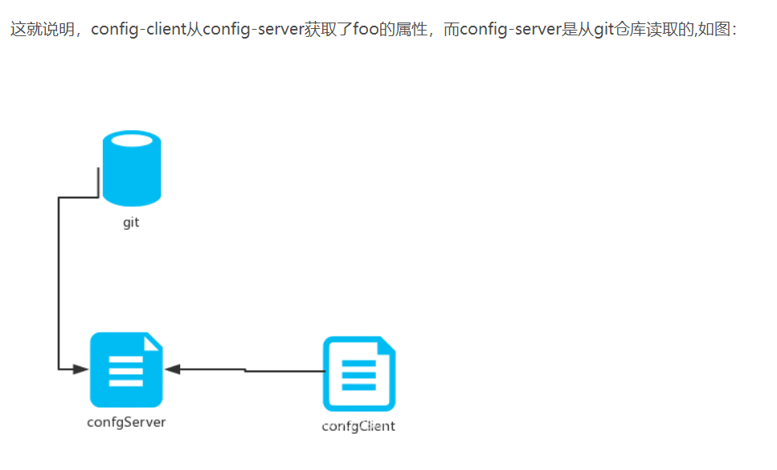

1、在分布式系统中，由于服务数量巨多，为了方便服务配置文件统一管理，实时更新，所以需要分布式配置中心组件。在Spring Cloud中，有分布式配置中心组件spring cloud config ，它支持配置服务放在配置服务的内存中（即本地），也支持放在远程Git仓库中(SpringcloudConfig)。在spring cloud config 组件中，分两个角色，一是config server，二是config client。

2、当服务实例很多时，都从配置中心读取文件，这时可以考虑将配置中心做成一个微服务，将其集群化，从而达到高可用，架构图如下：
.jpg)

